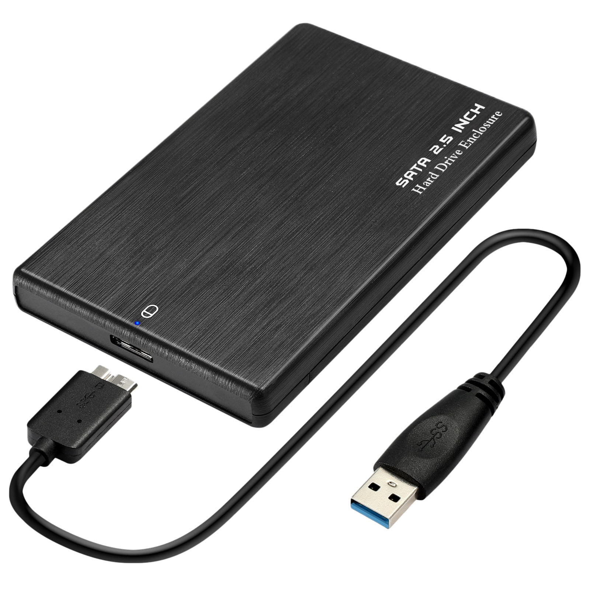

# Portable Disk Backup Script 💽
### PowerShell module for backing up a removable Disk Drive
<div>
  

  

  
</div>

## How to use?
> [!IMPORTANT]
> You must run the module as administrator inside PowerShell to prevent permission problems.

### 1. Remove any existing PowerShell module
```powerShell
Remove-Module Respaldos
```

### 2. Import module
```powershell
Import-Module C:/route/to/PSModuleW'Robocopy/Respaldos.psm1
```

### 3. Check if the code is the last modified (Optional)
```powershell
Get-Command Remove-CloneFolder | Select-Object -ExpandProperty Definition
```

### 4. Backup
```powershell
Remove-CloneFolder -Source "D:\my-most-valuable-data" -destination "E:\my-most-valuable-data"
```

> [!TIP]
> Optionally, you can export the module: \
> *Export-ModuleMember -Function Remove-CloneFolder*

> [!WARNING]
> I assume that you have already edited the registry key `HKEY_LOCAL_MACHINE\SYSTEM\CurrentControlSet\Control\FileSystem` in regedit. You must change the value for the key `LongPathsEnabled` (DWORD) from 0 to 1 and then save.

> [!IMPORTANT]
> ## PowerShell needs to be unrestricted to run scripts
> Try the following command:
> *Set-ExecutionPolicy -ExecutionPolicy Unrestricted*
>
> [See the official site](https://learn.microsoft.com/es-es/previous-versions/windows/powershell-scripting/hh847748(v=wps.640)?redirectedfrom=MSDN)
